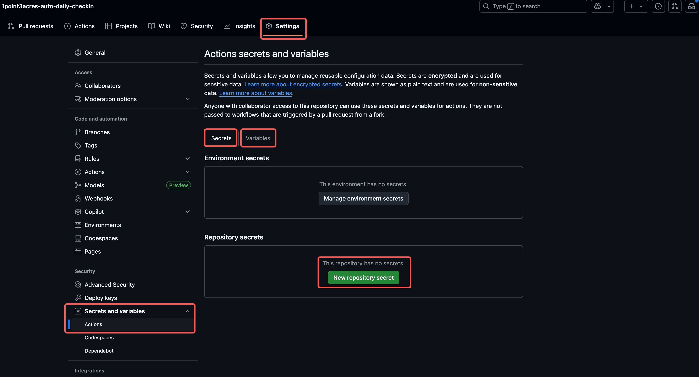
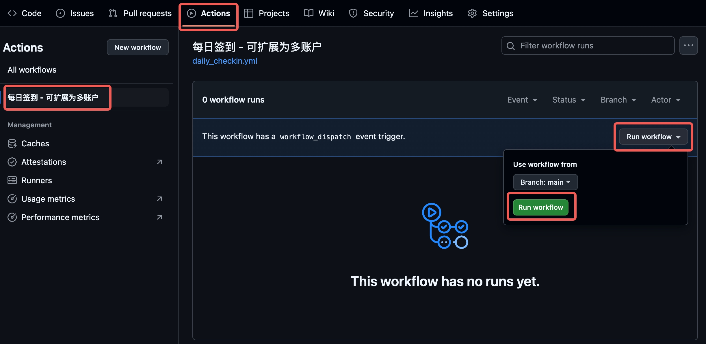
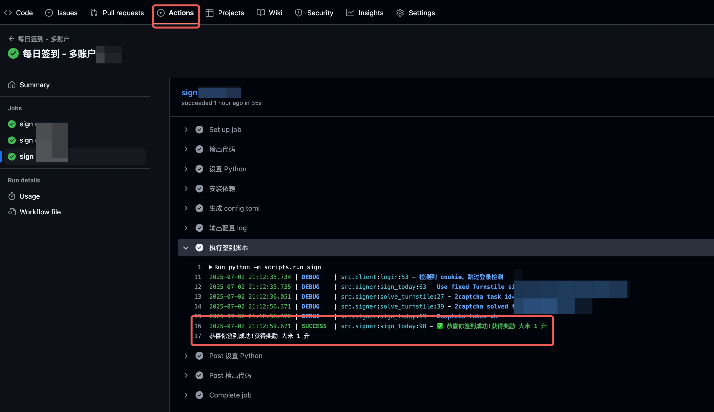
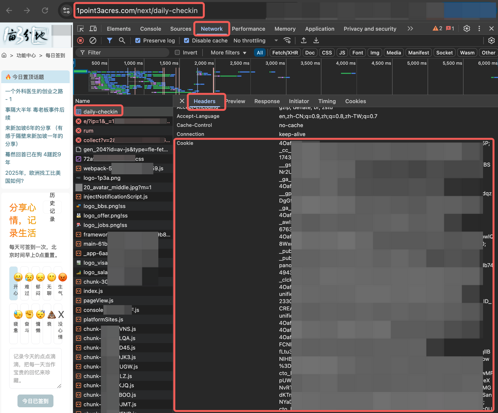

# 一亩三分地 全自动每日签到+大米

> **一亩三分地论坛每日自动签到脚本**
> 
> *Zero‑touch daily check‑in & "大米" farming on GitHub Actions*

------

## ✨ 功能亮点

| 功能                      | 说明                                                    |
| ------------------------- | ------------------------------------------------------- |
| 自动签到                  | 利用 GitHub Actions 每日定时执行，免开电脑、省时省心    |
| Cloudflare Turnstile 绕过 | 内置 2captcha 解码；无需手动点验证                      |
| 多账户支持                | 通过 **matrix** 或 **GitHub Environments** 扩展无限账号 |
| 日志可视化                | Actions 日志实时输出签到结果与积分增量                  |
| 可扩展                    | 模块化设计，可追加每日答题、帖子浏览、AI 总结等脚本     |

> **友情提示**：自动化脚本可能违反论坛 ToS，请自担风险，勿滥用。

------

## 🚀 3 分钟快速上手

1. **Fork 本仓库**
   - 点击右上角 `Fork` 按钮，将项目复制到自己的 GitHub 账号。
2. **启用 GitHub Actions**
   - 进入 fork 后仓库 → **Settings → Actions → General**。
   - 在 **Workflow permissions** 选择 **Read and write permissions** 并保存。
3. **添加 Secrets（单账号最简单）**
   - 打开 **Settings → Secrets and variables → Actions** → **New repository secret**，按下表添加 4 个条目：

| Name          | 必填 | 示例值                           | 说明                                                         |
| ------------- | ---- | -------------------------------- | ------------------------------------------------------------ |
| `COOKIE`      | ✅    | `chii_auth=xxxxxxxx; other=yyy;` | 浏览器复制的整串 Cookie（见下文）配置在 secret 里。          |
| `CAPTCHA_KEY` | ✅    | `1234567890abcdef`               | 你的 2captcha API Key（余额 ≥ 0.002 USD）配置在 secret 里。  |
| `USERNAME`    | ✅    | `myforumid`                      | 论坛用户名（Cookie 失效时备用登录）配置在 variables 里即可。 |
| `PASSWORD`    | ❎    | `mypassword`                     | 论坛登录密码（Cookie 失效时备用登录）配置在 secret 里。      |



4. **手动触发 / 等待定时任务**
   - 进入 **Actions → Daily Check‑in** Workflow，点击 **Run workflow** 验证首跑是否成功。
   - 成功后脚本会自动按照工作流中的 `schedule`（默认每日一次）运行。




> 完成以上 4 步，恭喜！你已拥有一台 24×7 的“云端摸鱼机”。

------

## 🍪 如何获取 1point3acres Cookie

> 需复制整串。

1. 打开浏览器登录 https://1point3acres.com/next/daily-checkin
2. 按 **F12** → 切换到 **Application / Storage** 面板 → 左侧 **Cookies** → 选择域名。
3. 找到 `daily-checkin`等字段，全选整行 **Cookie 字符串**（字段间以 `; `分隔）。可能需要刷新页面。
4. 粘贴到 `COOKIE` Secret 中保存。



> **Cookie 有效期约 30 天**；过期后脚本会尝试用 `USERNAME/PASSWORD` 自动刷新，但依赖验证码成功率。建议每月末手动更新一次 Cookie。

------

## 🔑 获取 2captcha API Key

1. 注册 [https://2captcha.com](https://2captcha.com/)
2. 进入 Dashboard → `API Key` 区域复制 32 位字符串。
3. 充值 **≥ 1 USD**，余额足够即在脚本调用时自动扣费。

> 每次 Turnstile 解码约 0.00145 USD；1000 次 ≈ 1.45 USD。每个月的开销是0.3元人民币。

------

## 👥 多账户配置

### 方法 A · GitHub Environments（推荐）

1. **Settings → Environments** → **New environment**，名称例如 `acc1`、`acc2`。
2. 在对应 Environment 下分别添加 **COOKIE / CAPTCHA_KEY / USERNAME / PASSWORD** Secrets。
3. 编辑 `.github/workflows/daily_checkin.yml` → 修改：

```yaml
environment: ${{ matrix.env }}  # 关键行
strategy:
  matrix:
    env: [acc1, acc2, acc3]     # 填你的环境名列表
```

> 优点：每个账户的 Cookie 隔离，更新互不影响。

### 方法 B · Repository Secrets（简单）

- 再添加 `COOKIE_2`, `USERNAME_2`… 依此类推。
- workflow 中扩展 `env:` 变量读取即可。

------

## 🛠️ 常见错误排查

| 日志提示                | 可能原因                        | 解决方案                                                     |
| ----------------------- | ------------------------------- | ------------------------------------------------------------ |
| `登录失败: cookie 无效` | Cookie 到期 / 复制不完整        | 重新抓取最新 Cookie；确认包含所有字段 & 分号                 |
| `2captcha balance 0`    | 余额不足 / API Key 错误         | 登录 2captcha 充值；检查 `CAPTCHA_KEY` 是否粘贴正确          |
| `SITE KEY NOT FOUND`    | 论坛更换 Turnstile sitekey      | 更新 `src/signer.py` 中 `SITEKEY` 或等待脚本自动解析新版（若已实现） |
| Action 不触发           | Actions 被禁用 / 时区与计划不符 | 确认 **Settings → Actions** 已启用；修改 `cron` 表达式       |
| `403 Cloudflare`        | IP 被 Cloudflare Ban            | 在 workflow 中使用 `proxy: true` 或等待 IP 解封              |

------

## 🔄 Cookie 自动刷新（可选）

> 想彻底摆脱手动更新？可新增 `refresh_cookie.yml` 工作流每月 25 日运行：
>
> 1. 使用 `USERNAME/PASSWORD` 登录获取新 Cookie；
> 2. 调 `gh api` 将最新 Cookie 写回对应 Secret；
> 3. （可选）推送通知到 Slack / 邮件。

示例脚本参考 `scripts/refresh_cookie.py`，或查看 Releases 中的模板。

------

## 🤝 贡献指南

1. **Fork & PR**：欢迎提交功能改进、Bug 修复。
2. **Issue**：任何使用问题、站点改动可在 Issue 区反馈。
3. **编码规范**：请遵守 PEP 8，新增功能需附带 pytest 单元测试。

------

## 📜 许可证 & 免责声明

- 本项目采用 **MIT License** 发行。
- 本脚本仅用于个人学习研究目的，使用者需自行承担因自动化操作带来的账号封禁或其他风险。
- 若论坛运营方认为本项目侵害其合法权益，可通过 Issue / Email 联系删除。

------

> **Keep Calm & Happy Farming!** ✌️


# 原 README.md

这是一个用于一亩三分地每日自动签到的脚本，支持多账户签到。使用 GitHub Action 在每天的指定时间自动运行，完成签到任务。

1. 支持多账户配置，方便管理不同用户的签到任务。
2. 自动处理 Cloudflare 验证，确保签到请求顺利发送。
3. 提供详细的日志输出，便于排查问题。

## 功能清单
- [x] 自动每日签到
    - [x] GitHub Actions 定时任务 workflow：`.github/workflows/daily_checkin.yml`
    - [x] 支持多账户配置
    - [x] 每日定时自动运行脚本签到
    - [ ] 串并行解决时长问题
    - [x] 提供详细的日志输出
    - [x] 自动处理 Cloudflare 验证
        - [x] 2captcha 验证 API key 自掏腰包ing
    - [ ] 用户名密码登录 debug，解决仍然需要手动更新 cookies 的问题
- [ ] 自动每日答题
    - [ ] 获取每日一题的答案
    - [ ] 答题结果自动提交
- [ ] 自动每日浏览
    - [ ] 自动浏览置顶帖子
    - [ ] 自动抓取每日高热内容
    - [ ] AI 自动总结
- [ ] 自动通知和信息推送
    - [ ] 报错通知 bot
    - [ ] 每日信息推送 bot

## 开发日志
- 2025-07-02
    - 实现了每日签到功能，使用 GitHub Actions 定时任务自动运行。
    - 完成多账户支持，使用 GitHub Actions 的 Environment 功能动态切换账户。
    - 优化了日志输出，便于查看每个账户的签到状态。
    - 当前仍然需要手动更新 cookies，计划在后续版本中实现自动登录获取 cookies 的功能。
